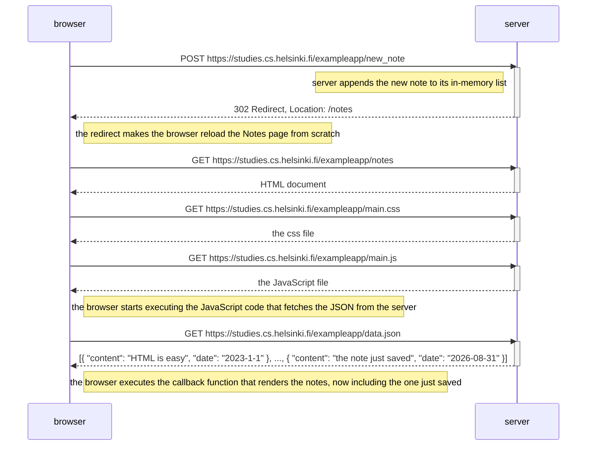

# 0.4: New note diagram

User writes a note into the text field on
https://studies.cs.helsinki.fi/exampleapp/notes and clicks Save.

```mermaid
sequenceDiagram
    participant browser
    participant server

    browser->>server: POST https://studies.cs.helsinki.fi/exampleapp/new_note
    activate server
    Note left of server: server appends the new note to its in-memory list
    server-->>browser: 302 Redirect, Location: /notes
    deactivate server

    Note right of browser: the redirect makes the browser reload the Notes page from scratch

    browser->>server: GET https://studies.cs.helsinki.fi/exampleapp/notes
    activate server
    server-->>browser: HTML document
    deactivate server

    browser->>server: GET https://studies.cs.helsinki.fi/exampleapp/main.css
    activate server
    server-->>browser: the css file
    deactivate server

    browser->>server: GET https://studies.cs.helsinki.fi/exampleapp/main.js
    activate server
    server-->>browser: the JavaScript file
    deactivate server

    Note right of browser: the browser starts executing the JavaScript code that fetches the JSON from the server

    browser->>server: GET https://studies.cs.helsinki.fi/exampleapp/data.json
    activate server
    server-->>browser: [{ "content": "HTML is easy", "date": "2023-1-1" }, ..., { "content": "the note just saved", "date": "2026-08-31" }]
    deactivate server

    Note right of browser: the browser executes the callback function that renders the notes, now including the one just saved
```
