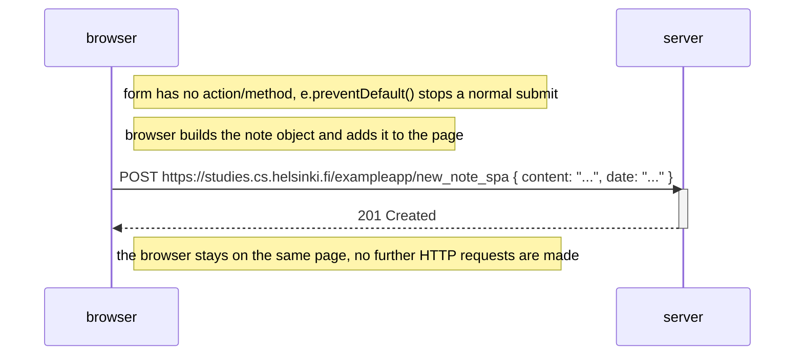

# 0.6: New note in Single page app diagram

User writes a note on https://studies.cs.helsinki.fi/exampleapp/spa and
clicks Save.

```mermaid
sequenceDiagram
    participant browser
    participant server

    Note right of browser: form has no action/method, e.preventDefault() stops a normal submit
    Note right of browser: browser builds the note object and adds it to the page

    browser->>server: POST https://studies.cs.helsinki.fi/exampleapp/new_note_spa { content: "...", date: "..." }
    activate server
    server-->>browser: 201 Created
    deactivate server

    Note right of browser: the browser stays on the same page, no further HTTP requests are made
```
